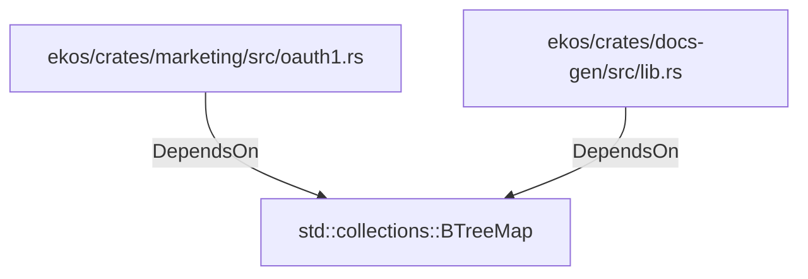

# std::collections::BTreeMap (RustModule)

## Properties

_No compiled properties._

## Relationships

### DependsOn

- ← ekos/crates/marketing/src/oauth1.rs (`d9547f96-f031-5a9d-875d-5912db96b474`)
- ← ekos/crates/docs-gen/src/lib.rs (`6ca4fba0-18e5-59b7-9876-7dae72e2ce0e`)

## Diagram

## Evidence

_No evidence cited._
