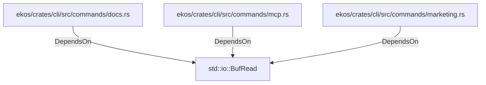

# std::io::BufRead (RustModule)

## Properties

_No compiled properties._

## Relationships

### DependsOn

- ← ekos/crates/cli/src/commands/docs.rs (`5503d15b-112f-541f-8189-8be05a060beb`)
- ← ekos/crates/cli/src/commands/mcp.rs (`ff76bb73-9285-5295-927c-5cb33a5bbc25`)
- ← ekos/crates/cli/src/commands/marketing.rs (`e4550c2d-5dcf-5779-b25d-ac86e4019342`)

## Diagram

## Evidence

_No evidence cited._
