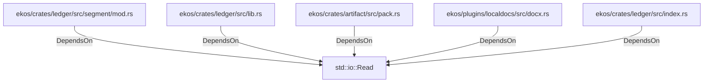

# std::io::Read (RustModule)

## Properties

_No compiled properties._

## Relationships

### DependsOn

- ← ekos/crates/ledger/src/segment/mod.rs (`80a64e0a-b0ac-51df-b3be-128cddd1cc83`)
- ← ekos/crates/ledger/src/lib.rs (`21938f45-b767-5933-9e71-12e15ff53eb1`)
- ← ekos/crates/artifact/src/pack.rs (`98cd7507-d9e7-59e3-acfb-c7ffb05d9f73`)
- ← ekos/plugins/localdocs/src/docx.rs (`cb8db45b-ec2c-50f2-8053-0fd63dba3355`)
- ← ekos/crates/ledger/src/index.rs (`a43fa387-2cac-5166-bfc2-ae4c965fc2ac`)

## Diagram

## Evidence

_No evidence cited._
