# std::io::Write (RustModule)

## Properties

_No compiled properties._

## Relationships

### DependsOn

- ← ekos/crates/ledger/src/segment/mod.rs (`80a64e0a-b0ac-51df-b3be-128cddd1cc83`)
- ← ekos/crates/artifact/src/pack.rs (`98cd7507-d9e7-59e3-acfb-c7ffb05d9f73`)
- ← ekos/crates/cli/src/commands/docs.rs (`5503d15b-112f-541f-8189-8be05a060beb`)
- ← ekos/plugins/localdocs/src/ocr.rs (`815f45c0-f388-5213-9201-2c6958a02eba`)
- ← ekos/crates/ledger/src/index.rs (`a43fa387-2cac-5166-bfc2-ae4c965fc2ac`)
- ← ekos/crates/cli/src/commands/mcp.rs (`ff76bb73-9285-5295-927c-5cb33a5bbc25`)
- ← ekos/crates/cli/src/commands/marketing.rs (`e4550c2d-5dcf-5779-b25d-ac86e4019342`)

## Diagram

```mermaid
graph TD
    n0a1e3b715cb05dba9eacf821ed97970c["std::io::Write"]
    n80a64e0ab0ac51dfb3be128cddd1cc83["ekos/crates/ledger/src/segment/mod.rs"]
    n80a64e0ab0ac51dfb3be128cddd1cc83 -->|DependsOn| n0a1e3b715cb05dba9eacf821ed97970c
    n98cd7507d9e759e3acfbc7ffb05d9f73["ekos/crates/artifact/src/pack.rs"]
    n98cd7507d9e759e3acfbc7ffb05d9f73 -->|DependsOn| n0a1e3b715cb05dba9eacf821ed97970c
    n5503d15b112f541f81898be05a060beb["ekos/crates/cli/src/commands/docs.rs"]
    n5503d15b112f541f81898be05a060beb -->|DependsOn| n0a1e3b715cb05dba9eacf821ed97970c
    n815f45c0f388521392012c6958a02eba["ekos/plugins/localdocs/src/ocr.rs"]
    n815f45c0f388521392012c6958a02eba -->|DependsOn| n0a1e3b715cb05dba9eacf821ed97970c
    na43fa3872cac5166bfc2ae4c965fc2ac["ekos/crates/ledger/src/index.rs"]
    na43fa3872cac5166bfc2ae4c965fc2ac -->|DependsOn| n0a1e3b715cb05dba9eacf821ed97970c
    nff76bb7392855295927c5cb33a5bbc25["ekos/crates/cli/src/commands/mcp.rs"]
    nff76bb7392855295927c5cb33a5bbc25 -->|DependsOn| n0a1e3b715cb05dba9eacf821ed97970c
    ne4550c2d5dcf5779b25dac86e4019342["ekos/crates/cli/src/commands/marketing.rs"]
    ne4550c2d5dcf5779b25dac86e4019342 -->|DependsOn| n0a1e3b715cb05dba9eacf821ed97970c
```

## Evidence

_No evidence cited._
