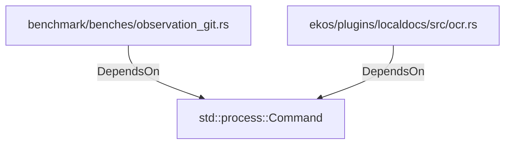

# std::process::Command (RustModule)

## Properties

_No compiled properties._

## Relationships

### DependsOn

- ← benchmark/benches/observation_git.rs (`ff3b4467-e5f5-5401-8b3f-2374fddfc13f`)
- ← ekos/plugins/localdocs/src/ocr.rs (`815f45c0-f388-5213-9201-2c6958a02eba`)

## Diagram

## Evidence

_No evidence cited._
