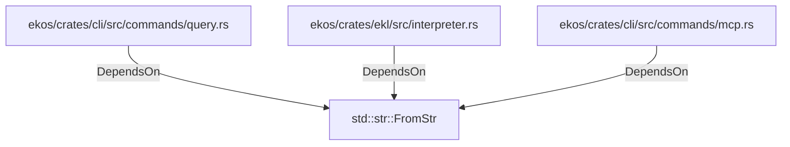

# std::str::FromStr (RustModule)

## Properties

_No compiled properties._

## Relationships

### DependsOn

- ← ekos/crates/cli/src/commands/query.rs (`76b10d14-834f-5bcb-8858-f46092b1989c`)
- ← ekos/crates/ekl/src/interpreter.rs (`9c2cb6e4-ee09-503f-8cf5-ccfaf23ecd79`)
- ← ekos/crates/cli/src/commands/mcp.rs (`ff76bb73-9285-5295-927c-5cb33a5bbc25`)

## Diagram

## Evidence

_No evidence cited._
