# std::sync::Mutex (RustModule)

## Properties

_No compiled properties._

## Relationships

### DependsOn

- ← ekos/crates/recovery/src/python_analyzer.rs (`196ca3fd-e85c-5ab9-a142-50f63dc586b9`)
- ← ekos/crates/compiler-core/src/pass.rs (`5189d0a2-3e2b-529e-adbf-3984a77be404`)
- ← ekos/crates/recovery/src/pentaho_analyzer.rs (`ce3d2f1b-e1c6-55d7-92bc-c1b69f76dbca`)
- ← ekos/crates/artifact/src/pack.rs (`98cd7507-d9e7-59e3-acfb-c7ffb05d9f73`)
- ← ekos/crates/ledger/src/fact_ledger.rs (`eadcb59e-818f-5d1e-af87-ff29aba11423`)
- ← ekos/crates/recovery/src/rust_analyzer.rs (`50cde56d-1f82-53a6-bc71-b5b2f7c711bc`)
- ← ekos/crates/recovery/src/sql_transform_analyzer.rs (`987e3fbb-31ec-576d-b794-7e801336e8c8`)
- ← ekos/crates/recovery/src/document_semantics_analyzer.rs (`62e92526-f096-5ed2-bc72-0bdae8703aa3`)

## Diagram

```mermaid
graph TD
    nc90e5d661f77503c8e4d32ab6849492e["std::sync::Mutex"]
    n196ca3fde85c5ab9a14250f63dc586b9["ekos/crates/recovery/src/python_analyzer.rs"]
    n196ca3fde85c5ab9a14250f63dc586b9 -->|DependsOn| nc90e5d661f77503c8e4d32ab6849492e
    n5189d0a23e2b529eadbf3984a77be404["ekos/crates/compiler-core/src/pass.rs"]
    n5189d0a23e2b529eadbf3984a77be404 -->|DependsOn| nc90e5d661f77503c8e4d32ab6849492e
    nce3d2f1be1c655d792bcc1b69f76dbca["ekos/crates/recovery/src/pentaho_analyzer.rs"]
    nce3d2f1be1c655d792bcc1b69f76dbca -->|DependsOn| nc90e5d661f77503c8e4d32ab6849492e
    n98cd7507d9e759e3acfbc7ffb05d9f73["ekos/crates/artifact/src/pack.rs"]
    n98cd7507d9e759e3acfbc7ffb05d9f73 -->|DependsOn| nc90e5d661f77503c8e4d32ab6849492e
    neadcb59e818f5d1eaf87ff29aba11423["ekos/crates/ledger/src/fact_ledger.rs"]
    neadcb59e818f5d1eaf87ff29aba11423 -->|DependsOn| nc90e5d661f77503c8e4d32ab6849492e
    n50cde56d1f8253a6bc71b5b2f7c711bc["ekos/crates/recovery/src/rust_analyzer.rs"]
    n50cde56d1f8253a6bc71b5b2f7c711bc -->|DependsOn| nc90e5d661f77503c8e4d32ab6849492e
    n987e3fbb31ec576db7947e801336e8c8["ekos/crates/recovery/src/sql_transform_analyzer.rs"]
    n987e3fbb31ec576db7947e801336e8c8 -->|DependsOn| nc90e5d661f77503c8e4d32ab6849492e
    n62e92526f0965ed2bc720bdae8703aa3["ekos/crates/recovery/src/document_semantics_analyzer.rs"]
    n62e92526f0965ed2bc720bdae8703aa3 -->|DependsOn| nc90e5d661f77503c8e4d32ab6849492e
```

## Evidence

_No evidence cited._
