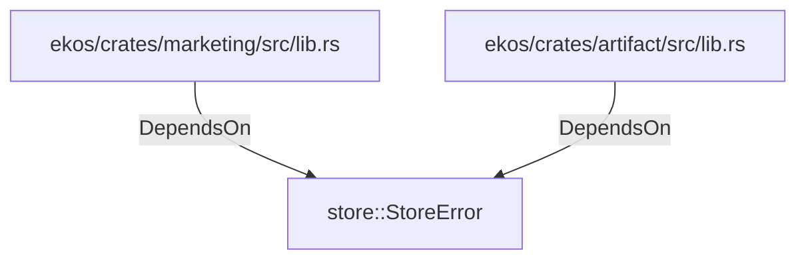

# store::StoreError (RustModule)

## Properties

_No compiled properties._

## Relationships

### DependsOn

- ← ekos/crates/marketing/src/lib.rs (`8cd87fe5-4192-5e8c-807b-1bdf11296172`)
- ← ekos/crates/artifact/src/lib.rs (`918532b1-7390-5128-8de5-faf4f7a91daf`)

## Diagram

## Evidence

_No evidence cited._
