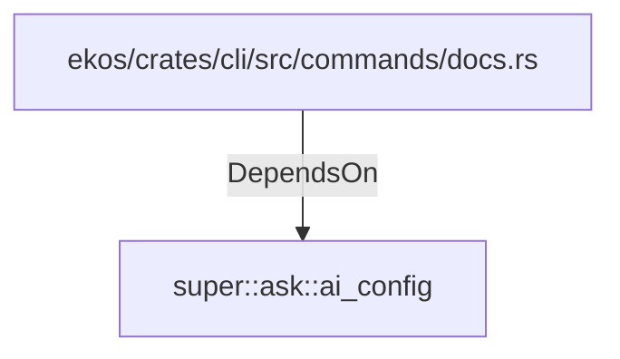

# super::ask::ai_config (RustModule)

## Properties

_No compiled properties._

## Relationships

### DependsOn

- ← ekos/crates/cli/src/commands/docs.rs (`5503d15b-112f-541f-8189-8be05a060beb`)

## Diagram

## Evidence

_No evidence cited._
