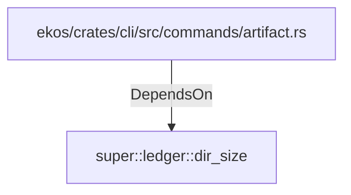

# super::ledger::dir_size (RustModule)

## Properties

_No compiled properties._

## Relationships

### DependsOn

- ← ekos/crates/cli/src/commands/artifact.rs (`06db81a6-f2c1-538b-bfce-452cf905f733`)

## Diagram

## Evidence

_No evidence cited._
