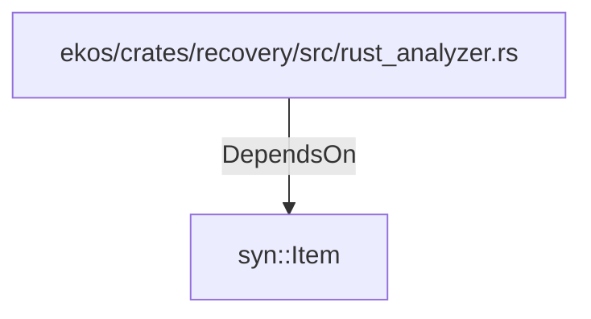

# syn::Item (RustModule)

## Properties

_No compiled properties._

## Relationships

### DependsOn

- ← ekos/crates/recovery/src/rust_analyzer.rs (`50cde56d-1f82-53a6-bc71-b5b2f7c711bc`)

## Diagram

## Evidence

_No evidence cited._
