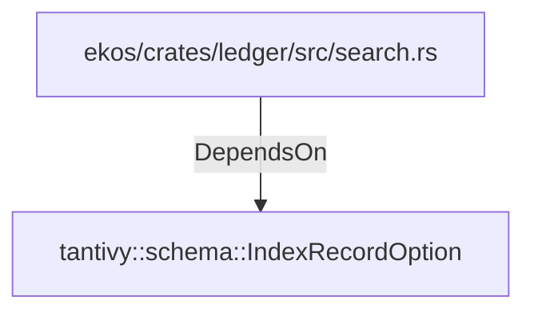

# tantivy::schema::IndexRecordOption (RustModule)

## Properties

_No compiled properties._

## Relationships

### DependsOn

- ← ekos/crates/ledger/src/search.rs (`b419f7f5-ae3b-50d7-9192-7ef6954555ce`)

## Diagram

## Evidence

_No evidence cited._
