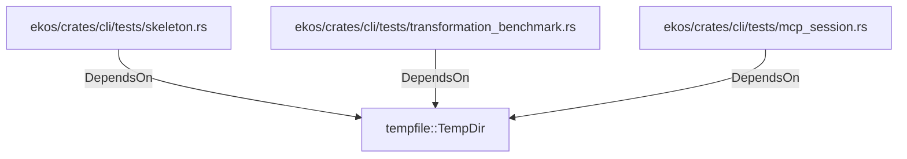

# tempfile::TempDir (RustModule)

## Properties

_No compiled properties._

## Relationships

### DependsOn

- ← ekos/crates/cli/tests/skeleton.rs (`c39b7026-a223-5e82-b5c8-7ed254f6ba84`)
- ← ekos/crates/cli/tests/transformation_benchmark.rs (`6f5dc4e7-3ce8-5dd3-ad8f-f66bbb5fabf5`)
- ← ekos/crates/cli/tests/mcp_session.rs (`201efc61-073b-5bcd-a5a8-a6c476333729`)

## Diagram

## Evidence

_No evidence cited._
