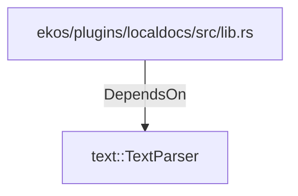

# text::TextParser (RustModule)

## Properties

_No compiled properties._

## Relationships

### DependsOn

- ← ekos/plugins/localdocs/src/lib.rs (`1ed81bd1-9be1-5cda-9158-9ad4f1980e3d`)

## Diagram

## Evidence

_No evidence cited._
