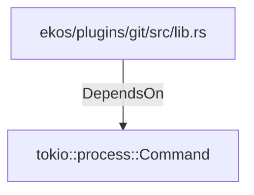

# tokio::process::Command (RustModule)

## Properties

_No compiled properties._

## Relationships

### DependsOn

- ← ekos/plugins/git/src/lib.rs (`8941bcba-6474-5c7b-af9e-97dc4f4f7a13`)

## Diagram

## Evidence

_No evidence cited._
