# walkdir::WalkDir (RustModule)

## Properties

_No compiled properties._

## Relationships

### DependsOn

- ← ekos/plugins/file/src/lib.rs (`7cdc5253-6617-5e49-81c7-9e227a76c44b`)
- ← ekos/plugins/pentaho/src/lib.rs (`cebff2b5-8142-5508-b8ad-01561647c1cc`)
- ← ekos/plugins/python/src/lib.rs (`a3158b70-7e78-5501-8593-4a22c3e9c266`)
- ← ekos/crates/cli/src/commands/recover.rs (`7e02bcf9-a7b4-5099-8255-130d9ef401bb`)
- ← ekos/plugins/rust/src/lib.rs (`1a06302f-f373-5d4e-9592-3d99844910e8`)
- ← ekos/plugins/localdocs/src/lib.rs (`1ed81bd1-9be1-5cda-9158-9ad4f1980e3d`)

## Diagram

```mermaid
graph TD
    n405eaea983a354b88ec5648321e34f23["walkdir::WalkDir"]
    n7cdc525366175e4981c79e227a76c44b["ekos/plugins/file/src/lib.rs"]
    n7cdc525366175e4981c79e227a76c44b -->|DependsOn| n405eaea983a354b88ec5648321e34f23
    ncebff2b581425508b8ad01561647c1cc["ekos/plugins/pentaho/src/lib.rs"]
    ncebff2b581425508b8ad01561647c1cc -->|DependsOn| n405eaea983a354b88ec5648321e34f23
    na3158b707e78550185934a22c3e9c266["ekos/plugins/python/src/lib.rs"]
    na3158b707e78550185934a22c3e9c266 -->|DependsOn| n405eaea983a354b88ec5648321e34f23
    n7e02bcf9a7b450998255130d9ef401bb["ekos/crates/cli/src/commands/recover.rs"]
    n7e02bcf9a7b450998255130d9ef401bb -->|DependsOn| n405eaea983a354b88ec5648321e34f23
    n1a06302ff3735d4e95923d99844910e8["ekos/plugins/rust/src/lib.rs"]
    n1a06302ff3735d4e95923d99844910e8 -->|DependsOn| n405eaea983a354b88ec5648321e34f23
    n1ed81bd19be15cda91589ad4f1980e3d["ekos/plugins/localdocs/src/lib.rs"]
    n1ed81bd19be15cda91589ad4f1980e3d -->|DependsOn| n405eaea983a354b88ec5648321e34f23
```

## Evidence

_No evidence cited._
