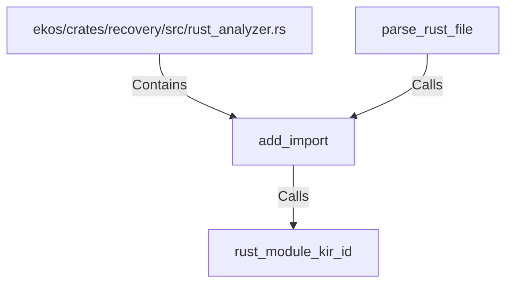

# add_import (RustSymbol)

## Properties

| Key | Value |
|---|---|
| `kind` | function |

## Relationships

### Calls

- ← parse_rust_file (`4cb8c941-1252-5ba3-be3c-b7d55f1a595d`)
- → rust_module_kir_id (`22873165-bc32-5c38-a219-22586895465f`)

### Contains

- ← ekos/crates/recovery/src/rust_analyzer.rs (`50cde56d-1f82-53a6-bc71-b5b2f7c711bc`)

## Diagram

## Evidence

_No evidence cited._
