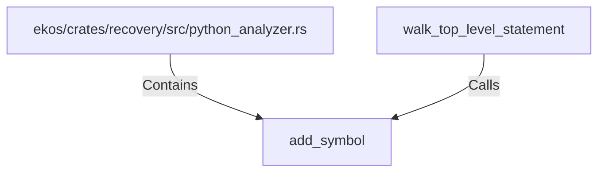

# add_symbol (RustSymbol)

## Properties

| Key | Value |
|---|---|
| `kind` | function |

## Relationships

### Calls

- ← walk_top_level_statement (`36a795d0-3788-5433-a369-2571af84e340`)

### Contains

- ← ekos/crates/recovery/src/python_analyzer.rs (`196ca3fd-e85c-5ab9-a142-50f63dc586b9`)

## Diagram

## Evidence

_No evidence cited._
