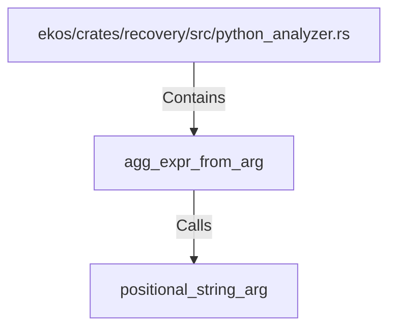

# agg_expr_from_arg (RustSymbol)

## Properties

| Key | Value |
|---|---|
| `kind` | function |

## Relationships

### Calls

- → positional_string_arg (`c82e0ed6-c517-5eb4-8987-4cf896e0b597`)

### Contains

- ← ekos/crates/recovery/src/python_analyzer.rs (`196ca3fd-e85c-5ab9-a142-50f63dc586b9`)

## Diagram

## Evidence

_No evidence cited._
