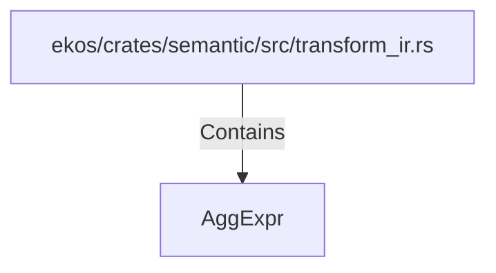

# AggExpr (RustSymbol)

## Properties

| Key | Value |
|---|---|
| `kind` | struct |

## Relationships

### Contains

- ← ekos/crates/semantic/src/transform_ir.rs (`b4fdd24c-8184-5879-9136-f0a70208955e`)

## Diagram

## Evidence

_No evidence cited._
