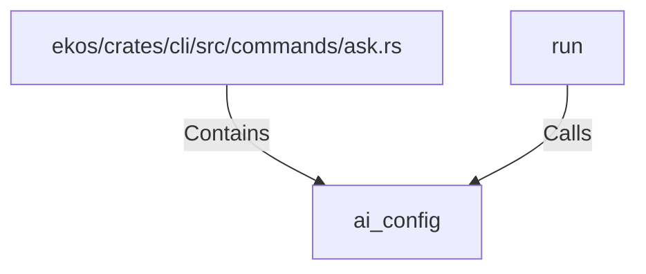

# ai_config (RustSymbol)

## Properties

| Key | Value |
|---|---|
| `kind` | function |

## Relationships

### Calls

- ← run (`9c8ba43a-4b5e-5f0a-9d4a-255129c016b4`)

### Contains

- ← ekos/crates/cli/src/commands/ask.rs (`e7e75efa-39cb-5182-b056-2fd16dfdc739`)

## Diagram

## Evidence

_No evidence cited._
