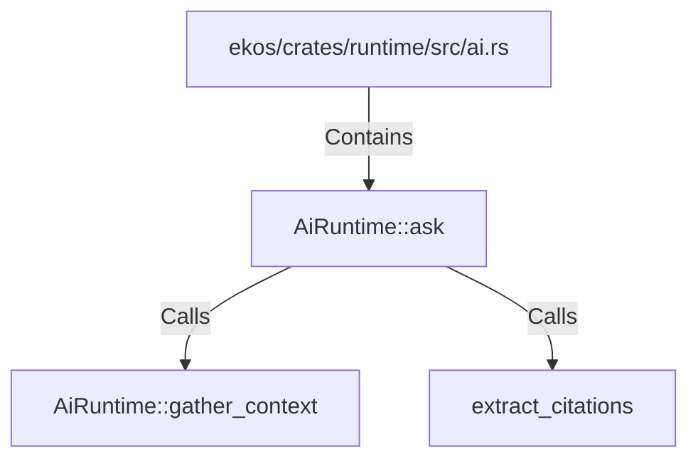

# AiRuntime::ask (RustSymbol)

## Properties

| Key | Value |
|---|---|
| `kind` | method |

## Relationships

### Calls

- → AiRuntime::gather_context (`e0e5f206-042c-5a81-8e86-1b9fbc4ab976`)
- → extract_citations (`8512d06f-0c17-5396-a99f-c7ab9a8705d4`)

### Contains

- ← ekos/crates/runtime/src/ai.rs (`e85e734d-ef58-5185-835a-34896d2da3f1`)

## Diagram

## Evidence

_No evidence cited._
