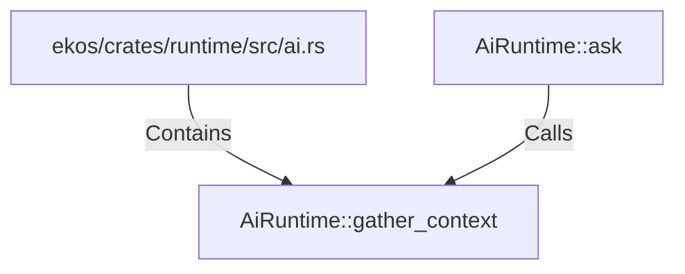

# AiRuntime::gather_context (RustSymbol)

## Properties

| Key | Value |
|---|---|
| `kind` | method |

## Relationships

### Calls

- ← AiRuntime::ask (`d454db52-b977-5cf8-8af9-6f5559a47666`)

### Contains

- ← ekos/crates/runtime/src/ai.rs (`e85e734d-ef58-5185-835a-34896d2da3f1`)

## Diagram

## Evidence

_No evidence cited._
