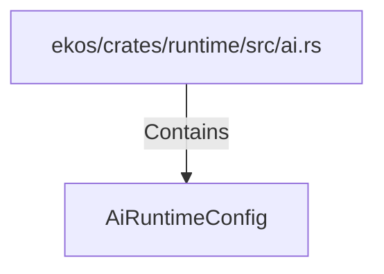

# AiRuntimeConfig (RustSymbol)

## Properties

| Key | Value |
|---|---|
| `kind` | struct |

## Relationships

### Contains

- ← ekos/crates/runtime/src/ai.rs (`e85e734d-ef58-5185-835a-34896d2da3f1`)

## Diagram

## Evidence

_No evidence cited._
