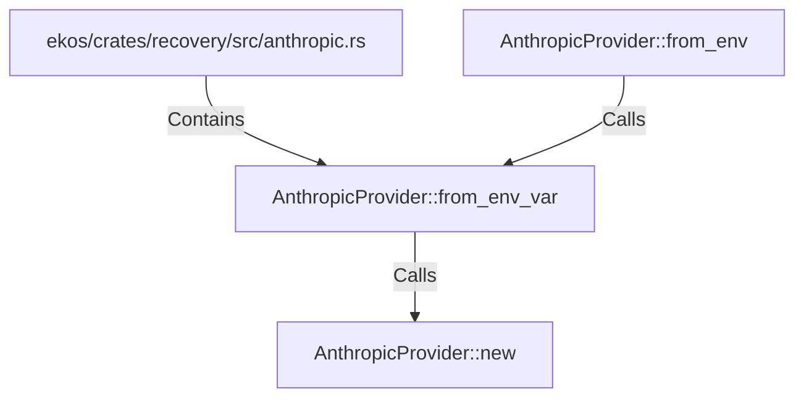

# AnthropicProvider::from_env_var (RustSymbol)

## Properties

| Key | Value |
|---|---|
| `kind` | method |

## Relationships

### Calls

- ← AnthropicProvider::from_env (`ed838f5b-8668-5189-84f7-a7aff2990686`)
- → AnthropicProvider::new (`77067109-e43a-500f-85f2-f0dcf8da3204`)

### Contains

- ← ekos/crates/recovery/src/anthropic.rs (`2b1d458b-2cbb-5b8a-9932-9c15c981a99e`)

## Diagram

## Evidence

_No evidence cited._
