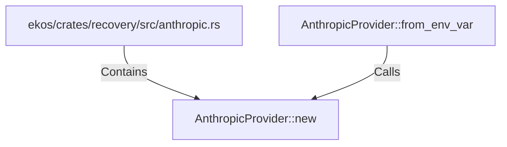

# AnthropicProvider::new (RustSymbol)

## Properties

| Key | Value |
|---|---|
| `kind` | method |

## Relationships

### Calls

- ← AnthropicProvider::from_env_var (`2bee47b8-82ec-52e5-951a-3768ba17cdf5`)

### Contains

- ← ekos/crates/recovery/src/anthropic.rs (`2b1d458b-2cbb-5b8a-9932-9c15c981a99e`)

## Diagram

## Evidence

_No evidence cited._
