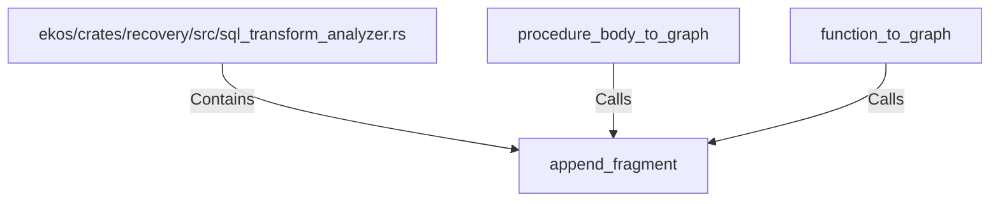

# append_fragment (RustSymbol)

## Properties

| Key | Value |
|---|---|
| `kind` | function |

## Relationships

### Calls

- ← procedure_body_to_graph (`7ec44c96-a38e-5bf5-8c0f-3683d9b61662`)
- ← function_to_graph (`fb4a63c1-3690-5bee-b424-6e26e9a46525`)

### Contains

- ← ekos/crates/recovery/src/sql_transform_analyzer.rs (`987e3fbb-31ec-576d-b794-7e801336e8c8`)

## Diagram

## Evidence

_No evidence cited._
