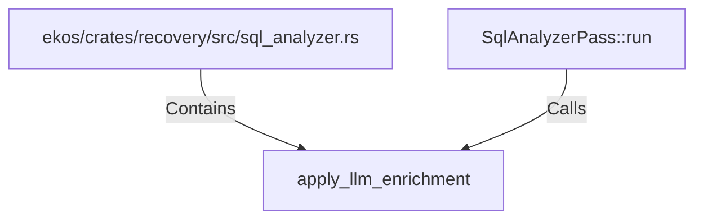

# apply_llm_enrichment (RustSymbol)

## Properties

| Key | Value |
|---|---|
| `kind` | function |

## Relationships

### Calls

- ← SqlAnalyzerPass::run (`9650fe07-6a5c-57dc-9a45-705995b82a4a`)

### Contains

- ← ekos/crates/recovery/src/sql_analyzer.rs (`cd768c5e-1640-51c3-b6ec-cb7ac78ade6d`)

## Diagram

## Evidence

_No evidence cited._
