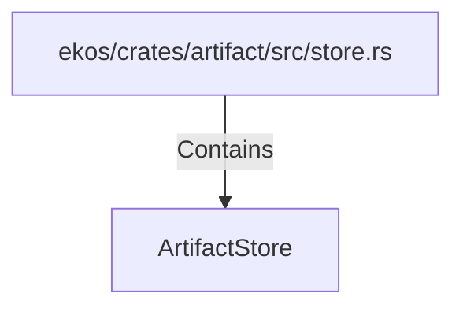

# ArtifactStore (RustSymbol)

## Properties

| Key | Value |
|---|---|
| `kind` | trait |

## Relationships

### Contains

- ← ekos/crates/artifact/src/store.rs (`d997f78d-b111-570e-b530-510e98c14df8`)

## Diagram

## Evidence

_No evidence cited._
