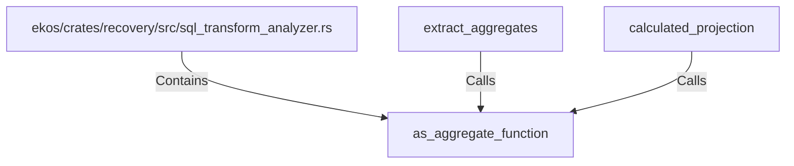

# as_aggregate_function (RustSymbol)

## Properties

| Key | Value |
|---|---|
| `kind` | function |

## Relationships

### Calls

- ← extract_aggregates (`4f3d3e2a-8b6d-57b9-a2f2-6c57d683e86f`)
- ← calculated_projection (`6b551d77-f70b-5867-8c24-e9593a282f1d`)

### Contains

- ← ekos/crates/recovery/src/sql_transform_analyzer.rs (`987e3fbb-31ec-576d-b794-7e801336e8c8`)

## Diagram

## Evidence

_No evidence cited._
