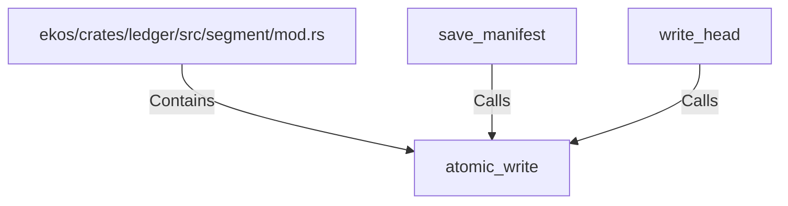

# atomic_write (RustSymbol)

## Properties

| Key | Value |
|---|---|
| `kind` | function |

## Relationships

### Calls

- ← save_manifest (`a67a0f9c-e213-50e7-9821-68cfa9ebf4d4`)
- ← write_head (`203436f8-4f5f-5f2b-93a8-b25fd11e5174`)

### Contains

- ← ekos/crates/ledger/src/segment/mod.rs (`80a64e0a-b0ac-51df-b3be-128cddd1cc83`)

## Diagram

## Evidence

_No evidence cited._
