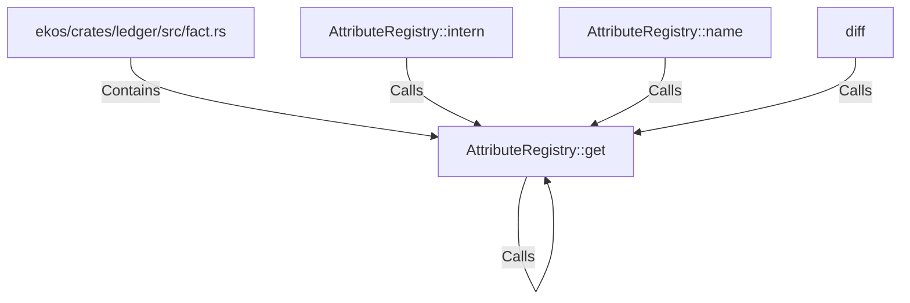

# AttributeRegistry::get (RustSymbol)

## Properties

| Key | Value |
|---|---|
| `kind` | method |

## Relationships

### Calls

- ← AttributeRegistry::intern (`1f29bac1-ffa9-5110-bbe2-6742ce05b657`)
- → AttributeRegistry::get (`fbad72cf-cfbb-5d3a-88c6-3462f9a7860b`)
- ← AttributeRegistry::name (`6f8b73f3-5dc9-536f-a72a-eaa0fd944f51`)
- ← diff (`326570a1-c9d8-552b-8e4d-43921bf22e90`)

### Contains

- ← ekos/crates/ledger/src/fact.rs (`7837f9fa-7178-5151-a068-e75361336c37`)

## Diagram

## Evidence

_No evidence cited._
