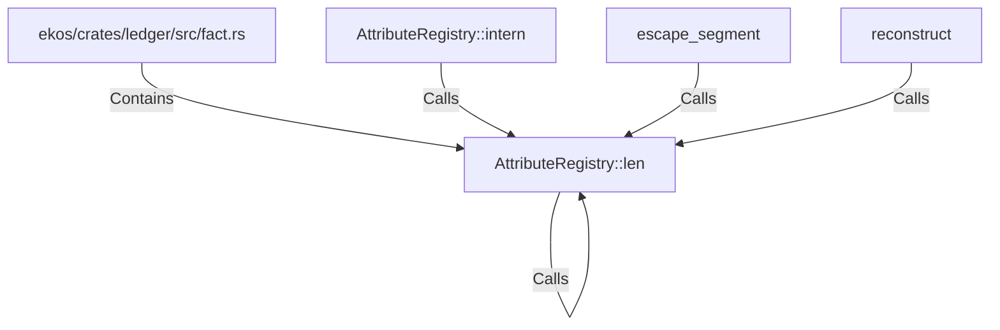

# AttributeRegistry::len (RustSymbol)

## Properties

| Key | Value |
|---|---|
| `kind` | method |

## Relationships

### Calls

- ← AttributeRegistry::intern (`1f29bac1-ffa9-5110-bbe2-6742ce05b657`)
- → AttributeRegistry::len (`c441faa0-58d8-5de0-9575-74cc0e087136`)
- ← escape_segment (`36efc953-06f8-55fd-8c9b-56ab9c679642`)
- ← reconstruct (`5afc145c-c6ce-5e30-9ac5-52b81dd3b22b`)

### Contains

- ← ekos/crates/ledger/src/fact.rs (`7837f9fa-7178-5151-a068-e75361336c37`)

## Diagram

## Evidence

_No evidence cited._
