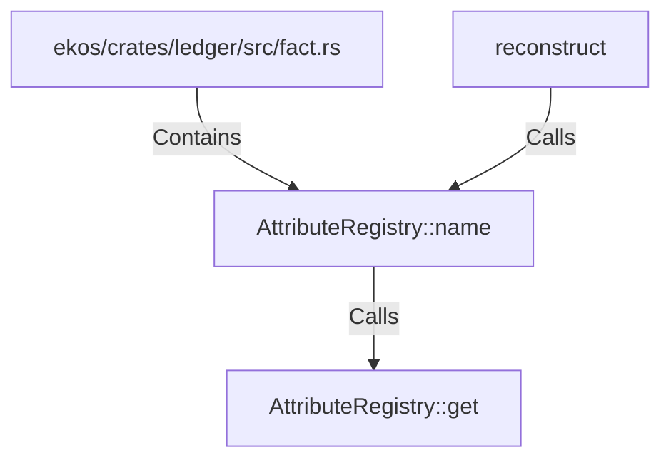

# AttributeRegistry::name (RustSymbol)

## Properties

| Key | Value |
|---|---|
| `kind` | method |

## Relationships

### Calls

- → AttributeRegistry::get (`fbad72cf-cfbb-5d3a-88c6-3462f9a7860b`)
- ← reconstruct (`5afc145c-c6ce-5e30-9ac5-52b81dd3b22b`)

### Contains

- ← ekos/crates/ledger/src/fact.rs (`7837f9fa-7178-5151-a068-e75361336c37`)

## Diagram

## Evidence

_No evidence cited._
