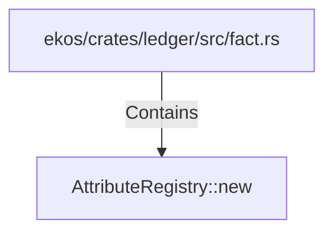

# AttributeRegistry::new (RustSymbol)

## Properties

| Key | Value |
|---|---|
| `kind` | method |

## Relationships

### Contains

- ← ekos/crates/ledger/src/fact.rs (`7837f9fa-7178-5151-a068-e75361336c37`)

## Diagram

## Evidence

_No evidence cited._
