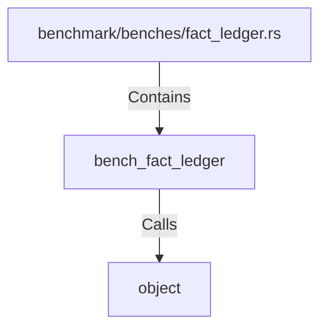

# bench_fact_ledger (RustSymbol)

## Properties

| Key | Value |
|---|---|
| `kind` | function |

## Relationships

### Calls

- → object (`5773c01e-5cc3-5702-8186-9fb0318c57be`)

### Contains

- ← benchmark/benches/fact_ledger.rs (`51ded36f-c9b2-5f8a-97c1-43fa4d7a63a1`)

## Diagram

## Evidence

_No evidence cited._
