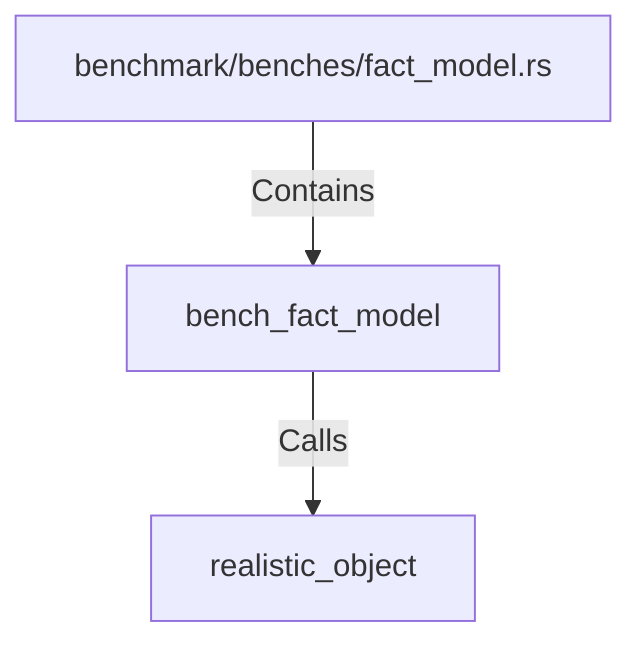

# bench_fact_model (RustSymbol)

## Properties

| Key | Value |
|---|---|
| `kind` | function |

## Relationships

### Calls

- → realistic_object (`0dcf9d8f-9390-5eba-9d38-0221d38cbbd0`)

### Contains

- ← benchmark/benches/fact_model.rs (`8764eb55-7e1c-540c-b1d2-6545dcef6699`)

## Diagram

## Evidence

_No evidence cited._
