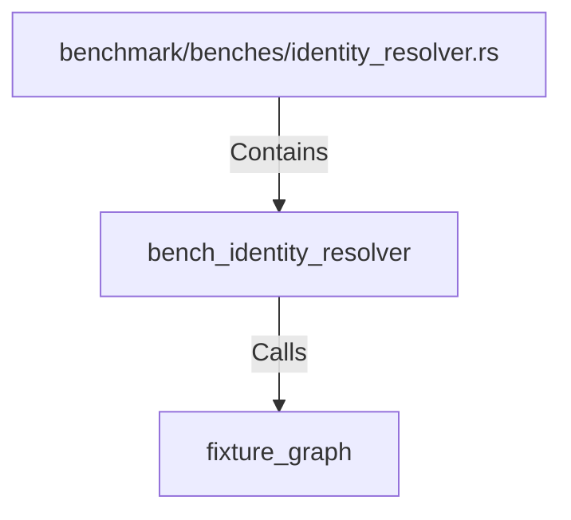

# bench_identity_resolver (RustSymbol)

## Properties

| Key | Value |
|---|---|
| `kind` | function |

## Relationships

### Calls

- → fixture_graph (`e3802af0-b9a2-5897-919f-2d25cf5f85dd`)

### Contains

- ← benchmark/benches/identity_resolver.rs (`98a76aee-0267-55e8-941f-d3a106eb2053`)

## Diagram

## Evidence

_No evidence cited._
