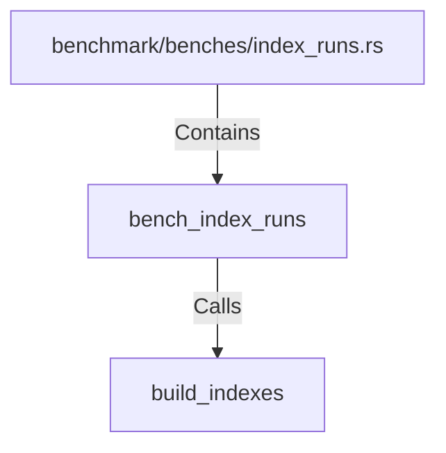

# bench_index_runs (RustSymbol)

## Properties

| Key | Value |
|---|---|
| `kind` | function |

## Relationships

### Calls

- → build_indexes (`38f04e4c-efad-5c3b-a82f-d5bb67cad13b`)

### Contains

- ← benchmark/benches/index_runs.rs (`3efee357-ff49-5ace-8153-f8ad82f0cd57`)

## Diagram

## Evidence

_No evidence cited._
