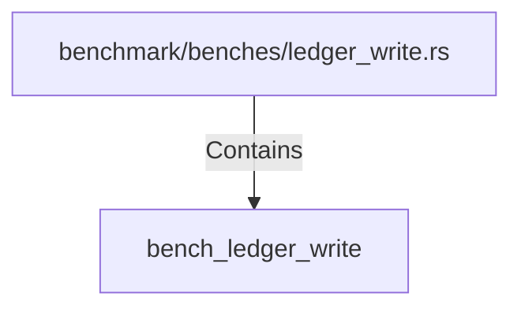

# bench_ledger_write (RustSymbol)

## Properties

| Key | Value |
|---|---|
| `kind` | function |

## Relationships

### Contains

- ← benchmark/benches/ledger_write.rs (`6b35bf13-a69a-59b1-8971-1df6156a8388`)

## Diagram

## Evidence

_No evidence cited._
