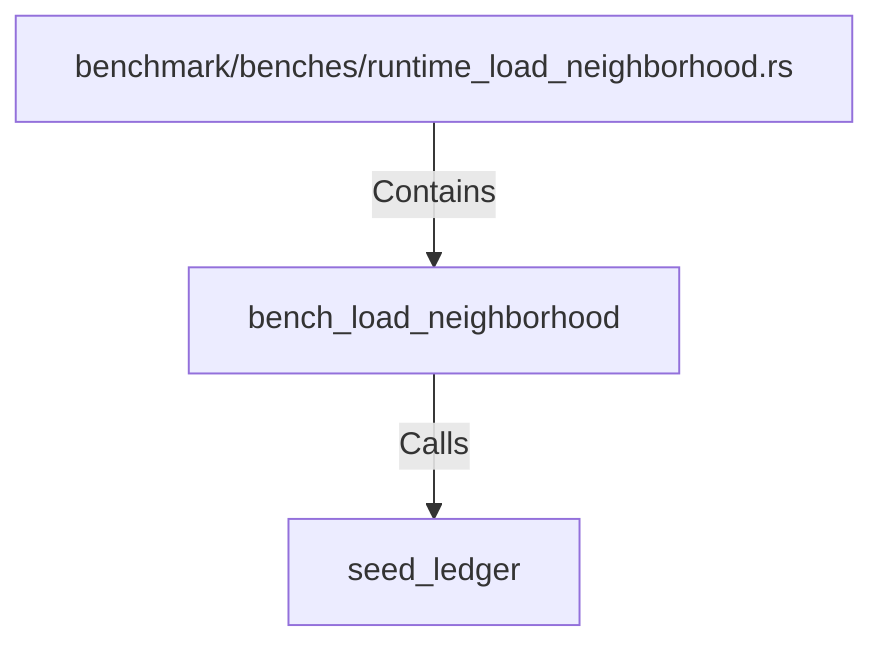

# bench_load_neighborhood (RustSymbol)

## Properties

| Key | Value |
|---|---|
| `kind` | function |

## Relationships

### Calls

- → seed_ledger (`f254ccd9-951e-52e0-bf6f-b59412361d11`)

### Contains

- ← benchmark/benches/runtime_load_neighborhood.rs (`ea98c002-3a2b-5dd6-9aee-01db9fa9bde1`)

## Diagram

## Evidence

_No evidence cited._
