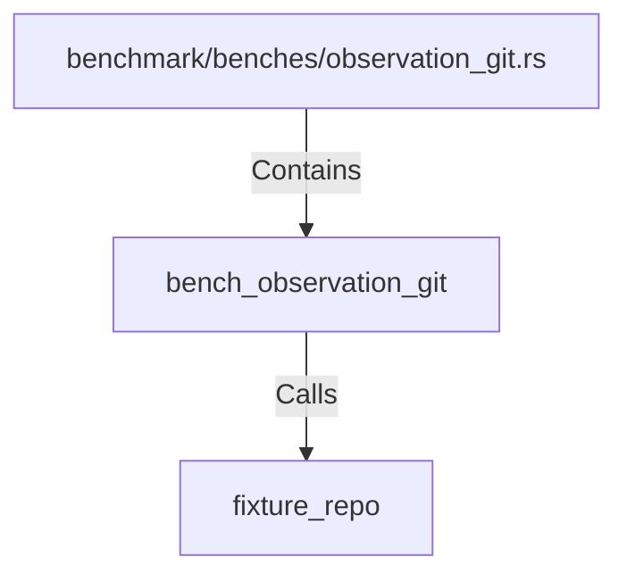

# bench_observation_git (RustSymbol)

## Properties

| Key | Value |
|---|---|
| `kind` | function |

## Relationships

### Calls

- → fixture_repo (`36aa5e81-5216-5d3e-a833-6d61aecfab29`)

### Contains

- ← benchmark/benches/observation_git.rs (`ff3b4467-e5f5-5401-8b3f-2374fddfc13f`)

## Diagram

## Evidence

_No evidence cited._
