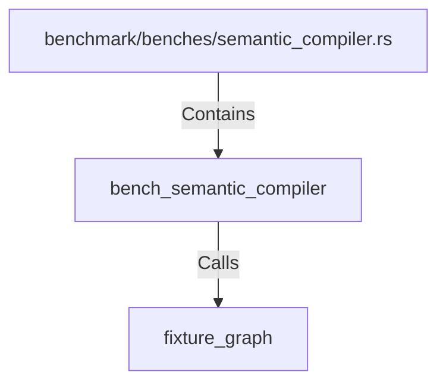

# bench_semantic_compiler (RustSymbol)

## Properties

| Key | Value |
|---|---|
| `kind` | function |

## Relationships

### Calls

- → fixture_graph (`33d7d35c-7f74-5e8c-adee-ed8d153a6f26`)

### Contains

- ← benchmark/benches/semantic_compiler.rs (`95222458-b6a4-5b9c-bcc9-0e2e1909eb44`)

## Diagram

## Evidence

_No evidence cited._
