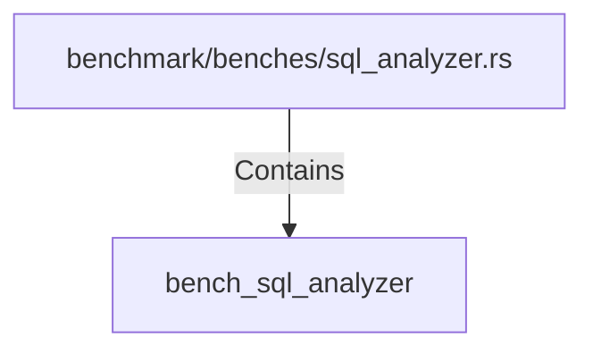

# bench_sql_analyzer (RustSymbol)

## Properties

| Key | Value |
|---|---|
| `kind` | function |

## Relationships

### Contains

- ← benchmark/benches/sql_analyzer.rs (`9f24ed23-7bfa-5f21-b42c-4937fbd2de4d`)

## Diagram

## Evidence

_No evidence cited._
