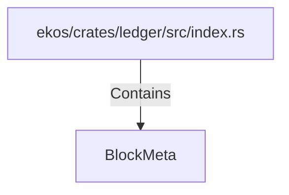

# BlockMeta (RustSymbol)

## Properties

| Key | Value |
|---|---|
| `kind` | struct |

## Relationships

### Contains

- ← ekos/crates/ledger/src/index.rs (`a43fa387-2cac-5166-bfc2-ae4c965fc2ac`)

## Diagram

## Evidence

_No evidence cited._
