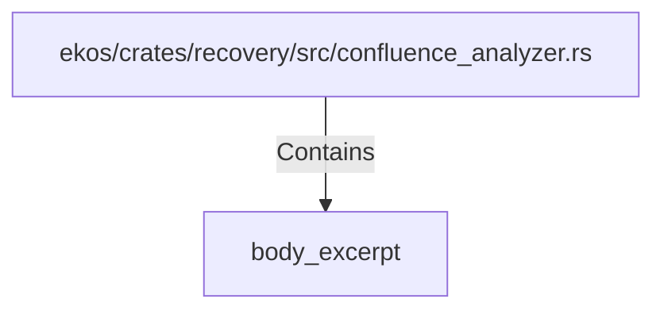

# body_excerpt (RustSymbol)

## Properties

| Key | Value |
|---|---|
| `kind` | function |

## Relationships

### Contains

- ← ekos/crates/recovery/src/confluence_analyzer.rs (`d1b7d840-ae82-5a26-b381-06fb944d4e3c`)

## Diagram

## Evidence

_No evidence cited._
