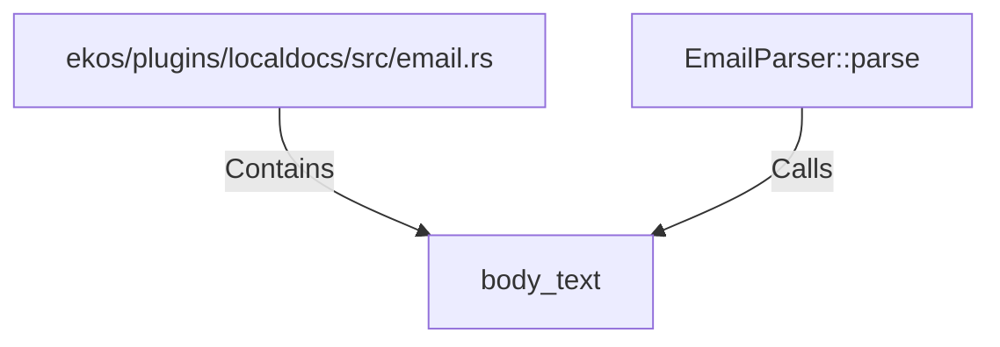

# body_text (RustSymbol)

## Properties

| Key | Value |
|---|---|
| `kind` | function |

## Relationships

### Calls

- ← EmailParser::parse (`f784bab1-c5b1-5155-b44d-018b4df1cf66`)

### Contains

- ← ekos/plugins/localdocs/src/email.rs (`fbdd8fb1-8ac2-5e5d-b95b-c1d0451eae6e`)

## Diagram

## Evidence

_No evidence cited._
