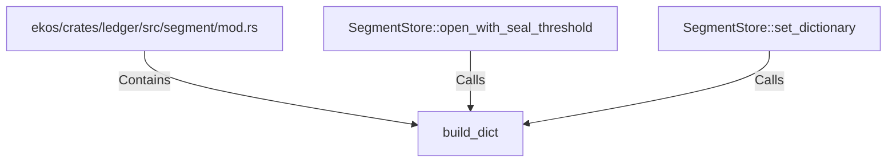

# build_dict (RustSymbol)

## Properties

| Key | Value |
|---|---|
| `kind` | function |

## Relationships

### Calls

- ← SegmentStore::open_with_seal_threshold (`f884dec9-a3e7-5e4e-88f6-1dc62c172078`)
- ← SegmentStore::set_dictionary (`2b91f5c6-37e4-54ff-9f4b-735785f13c04`)

### Contains

- ← ekos/crates/ledger/src/segment/mod.rs (`80a64e0a-b0ac-51df-b3be-128cddd1cc83`)

## Diagram

## Evidence

_No evidence cited._
