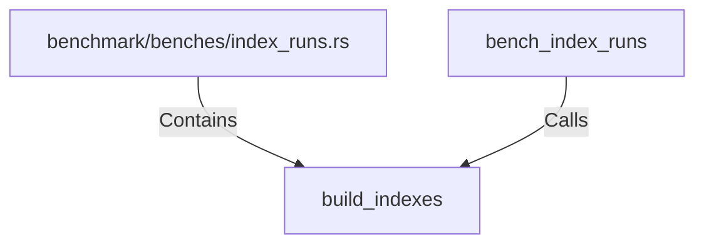

# build_indexes (RustSymbol)

## Properties

| Key | Value |
|---|---|
| `kind` | function |

## Relationships

### Calls

- ← bench_index_runs (`59404237-a9ef-5623-9427-3ab26acfbe48`)

### Contains

- ← benchmark/benches/index_runs.rs (`3efee357-ff49-5ace-8153-f8ad82f0cd57`)

## Diagram

## Evidence

_No evidence cited._
