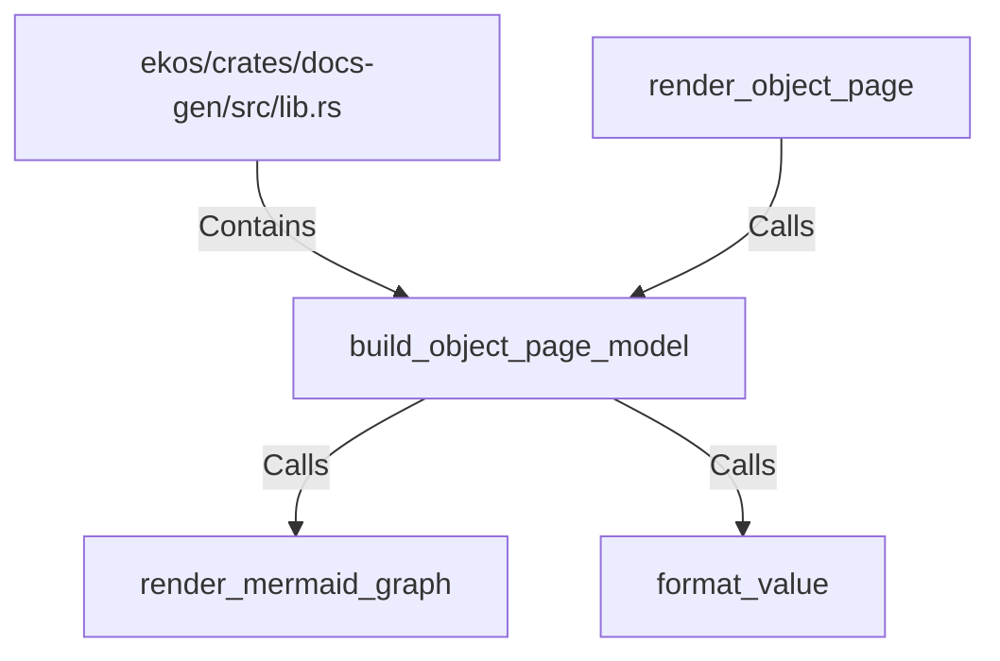

# build_object_page_model (RustSymbol)

## Properties

| Key | Value |
|---|---|
| `kind` | function |

## Relationships

### Calls

- → render_mermaid_graph (`35d5fb77-92f2-506e-ba73-0ffa1f0149a3`)
- → format_value (`08249438-7eae-5338-8318-b073fd1f7d01`)
- ← render_object_page (`cdc18413-eaf9-5b53-9989-839fc52293c1`)

### Contains

- ← ekos/crates/docs-gen/src/lib.rs (`6ca4fba0-18e5-59b7-9876-7dae72e2ce0e`)

## Diagram

## Evidence

_No evidence cited._
